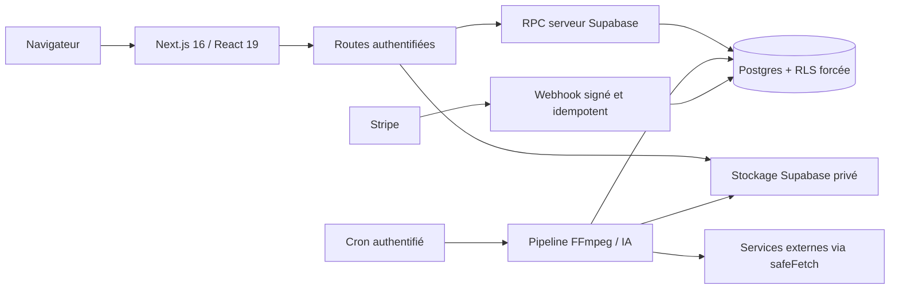

# Architecture de ClipsFlow

État de référence : 16 août 2026. Ce document décrit l'architecture réellement implémentée après le durcissement P0.

## Vue d'ensemble

Le navigateur peut lire les ressources de l'utilisateur selon les politiques RLS. Les mutations sensibles du cycle de vie des clips, jobs, quotas, limites de débit et abonnements sont réservées au serveur et passent par des fonctions Postgres atomiques ou par le client Supabase de service.

## Frontières de confiance

| Zone                  | Autorité admise                      | Contrôles obligatoires                                              |
| --------------------- | ------------------------------------ | ------------------------------------------------------------------- |
| Navigateur            | Session Supabase de l'utilisateur    | RLS forcée, validations Zod, aucune clé de service                  |
| Routes Next.js        | Cookie utilisateur + logique serveur | Authentification, propriété, quota, rate limit distribué            |
| Cron de traitement    | Secret de cron                       | Comparaison du secret, revendication atomique des jobs              |
| Supabase service role | Serveur uniquement                   | RPC dédiées, privilèges minimaux, transactions atomiques            |
| Webhook Stripe        | Signature Stripe valide              | Corps brut, idempotence, reprise après échec, ordre des événements  |
| Sorties réseau        | Hôtes explicitement autorisés        | HTTPS, port 443, DNS public, redirections revalidées, délai maximal |

`NEXT_PUBLIC_*` est public par définition. `SUPABASE_SERVICE_ROLE_KEY`, les clés privées des fournisseurs, `STRIPE_SECRET_KEY`, `STRIPE_WEBHOOK_SECRET` et `CRON_SECRET` ne doivent jamais atteindre le navigateur, les journaux, les URLs ou le dépôt Git.

## Données et invariants

Tables métier principales :

- `profiles` : identité applicative, plan, quota et état Stripe ordonné ;
- `episodes` : source appartenant à un utilisateur ;
- `clips` : configuration et résultat de rendu ;
- `jobs` : file de traitement et informations d'échec ;
- `api_rate_limits` : fenêtres de limitation partagées entre instances ;
- `stripe_webhook_events` : revendication, réussite et échec des événements Stripe.

Les tables utilisateur ont la RLS activée et forcée. Les rôles de navigateur ne peuvent pas créer ou altérer directement les états internes du pipeline. La migration P0 ajoute notamment les RPC serveur suivantes :

- `clips_submit_job` : valide propriété et quota, puis crée le clip et son job dans une transaction ;
- `consume_api_rate_limit` : consomme atomiquement une unité dans une fenêtre ;
- `stripe_claim_webhook_event`, `stripe_complete_webhook_event`, `stripe_fail_webhook_event` : rendent le traitement du webhook relançable et observable ;
- `stripe_apply_profile_event` : applique un état d'abonnement uniquement si l'événement est au moins aussi récent que le précédent.

## Pipeline de clip

1. L'utilisateur initialise l'upload ; le serveur crée l'épisode via le client de service.
2. L'utilisateur soumet un job ; `clips_submit_job` applique propriété, quota et atomicité.
3. Le cron revendique un job en attente et exécute transcription, traduction et rendu.
4. Toute ressource distante passe par `safeFetch`, y compris les redirections et la résolution DNS.
5. Un plan gratuit ou inconnu doit recevoir le watermark ClipsFlow. Un échec de watermark fait échouer le job : il n'existe plus de chemin « fail-open » sans marque.
6. La réussite écrit les artefacts privés et finalise le job. L'échec rembourse le quota selon la logique du pipeline.

## Facturation

Checkout et portail n'acceptent que l'origine applicative configurée. En production, `NEXT_PUBLIC_APP_URL` doit être une URL HTTPS explicite ; le `Host` fourni par la requête n'est pas une source de confiance.

Les créations Stripe utilisent des clés d'idempotence stables. Le webhook vérifie la signature, revendique l'événement, traite ou marque l'échec, puis applique les états par ordre de création Stripe. Un événement échoué reste relançable ; un événement déjà terminé est ignoré.

## Déploiement

La migration P0 doit être appliquée avant le code applicatif qui appelle ses RPC. La cible distante ne doit jamais être déduite d'une session CLI ou MCP existante : sa référence doit correspondre au nom d'hôte de `NEXT_PUBLIC_SUPABASE_URL` de l'environnement prévu.

Les contrôles locaux de référence sont documentés dans [phase-1-smoke-test.md](./phase-1-smoke-test.md). La procédure de production et le retour arrière sont dans [OPERATIONS.md](./OPERATIONS.md).
