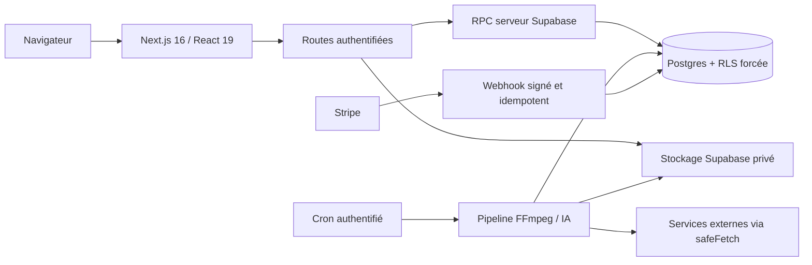

# Architecture de ClipsFlow

État de référence : 16 août 2026. Ce document décrit l'architecture réellement implémentée après le durcissement P0.

## Vue d'ensemble

```mermaid
flowchart LR
  U["Navigateur"] --> N["Next.js 16 / React 19"]
  N --> A["Routes authentifiées"]
  A --> R["RPC serveur Supabase"]
  R --> P[("Postgres + RLS forcée")]
  A --> S["Stockage Supabase privé"]
  C["Cron authentifié"] --> J["Pipeline FFmpeg / IA"]
  J --> P
  J --> S
  J --> E["Services externes via safeFetch"]
  T["Stripe"] --> W["Webhook signé et idempotent"]
  W --> P
```

Le navigateur peut lire les ressources de l'utilisateur selon les politiques RLS. Les mutations sensibles du cycle de vie des clips, jobs, quotas, limites de débit et abonnements sont réservées au serveur et passent par des fonctions Postgres atomiques ou par le client Supabase de service.

## Frontières de confiance

| Zone                  | Autorité admise                      | Contrôles obligatoires                                              |
| --------------------- | ------------------------------------ | ------------------------------------------------------------------- |
| Navigateur            | Session Supabase de l'utilisateur    | RLS forcée, validations Zod, aucune clé de service                  |
| Routes Next.js        | Cookie utilisateur + logique serveur | Authentification, propriété, quota, rate limit distribué            |
| Cron de traitement    | Secret de cron                       | Comparaison du secret, revendication atomique des jobs              |
| Supabase service role | Serveur uniquement                   | RPC dédiées, privilèges minimaux, transactions atomiques            |
| Webhook Stripe        | Signature Stripe valide              | Corps brut, idempotence, reprise après échec, ordre des événements  |
| Sorties réseau        | Hôtes explicitement autorisés        | HTTPS, port 443, DNS public, redirections revalidées, délai maximal |

`NEXT_PUBLIC_*` est public par définition. `SUPABASE_SERVICE_ROLE_KEY`, les clés privées des fournisseurs, `STRIPE_SECRET_KEY`, `STRIPE_WEBHOOK_SECRET` et `CRON_SECRET` ne doivent jamais atteindre le navigateur, les journaux, les URLs ou le dépôt Git.

## Données et invariants

Tables métier principales :

- `profiles` : identité applicative, plan, quota et état Stripe ordonné ;
- `episodes` : source appartenant à un utilisateur ;
- `clips` : configuration et résultat de rendu ;
- `jobs` : file de traitement et informations d'échec ;
- `api_rate_limits` : fenêtres de limitation partagées entre instances ;
- `stripe_webhook_events` : revendication, réussite et échec des événements Stripe.

Les tables utilisateur ont la RLS activée et forcée. Les rôles de navigateur ne peuvent pas créer ou altérer directement les états internes du pipeline. La migration P0 ajoute notamment les RPC serveur suivantes :

- `clips_submit_job` : valide propriété et quota, puis crée le clip et son job dans une transaction ;
- `consume_api_rate_limit` : consomme atomiquement une unité dans une fenêtre ;
- `stripe_claim_webhook_event`, `stripe_complete_webhook_event`, `stripe_fail_webhook_event` : rendent le traitement du webhook relançable et observable ;
- `stripe_apply_profile_event` : applique un état d'abonnement uniquement si l'événement est au moins aussi récent que le précédent.

## Pipeline de clip

1. L'utilisateur initialise l'upload ; le serveur crée l'épisode via le client de service.
2. L'utilisateur soumet un job ; `clips_submit_job` applique propriété, quota et atomicité.
3. Le cron revendique un job en attente et exécute transcription, traduction et rendu.
4. Toute ressource distante passe par `safeFetch`, y compris les redirections et la résolution DNS.
5. Un plan gratuit ou inconnu doit recevoir le watermark ClipsFlow. Un échec de watermark fait échouer le job : il n'existe plus de chemin « fail-open » sans marque.
6. La réussite écrit les artefacts privés et finalise le job. L'échec rembourse le quota selon la logique du pipeline.

## Parcours Shorts long format

Cette extension conserve le pipeline Clips pour les rendus et lui ajoute une
file d'analyse dédiée. Le code et les migrations sont présents localement ;
cela ne confirme ni l'application des migrations distantes ni le provisionnement
des workers.

1. `POST /api/shorts/uploads` crée un chemin appartenant à l'utilisateur et un
   jeton d'upload signé. Le navigateur envoie le fichier par TUS directement au
   bucket privé `clip-sources`; `/complete` vérifie l'objet, son propriétaire et
   sa taille avant de rendre l'épisode analysable.
2. `POST /api/shorts/projects` vérifie session, feature flag, limite de débit,
   budget fournisseur, plan et quota source, puis réserve projet et job par RPC
   idempotente. La transcription et l'analyse ne tournent pas dans la requête
   HTTP : `scripts/shorts-analysis-worker.ts` réclame un job sous bail.
3. Le worker télécharge et contrôle la source, transcrit sa piste audio via
   Whisper/Groq ou OpenAI, découpe toute la transcription en fenêtres
   déterministes puis demande à OpenAI de classer les identifiants de candidats
   dans une réponse structurée. Le modèle peut choisir/résumer les fenêtres,
   mais ne peut inventer leurs timestamps.
4. En mode audio + vidéo seulement, les images fixes sont extraites des fenêtres
   déjà classées par l'audio et analysées par Gemini. Seules ces images bornées
   sont envoyées; l'audio source n'est pas joint à cette requête, la
   reconnaissance faciale est désactivée et les images ne sont pas conservées.
5. Jev peut évaluer le classement après consentement explicite. Son ordre est
   stocké comme mesure privée shadow et ne remplace pas le classement remis au
   créateur. Un échec ou une configuration absente de Jev n'échoue pas l'analyse.
6. Le créateur examine les propositions et consignes, sélectionne les moments,
   puis le renderer reçoit les segments sélectionnés. La génération réutilise
   le worker Clips pour brûler les sous-titres synchronisés et appliquer crop,
   overlays et motion templates. La direction créative Opus 5.5 utilise
   l'identifiant Anthropic officiel fixe `claude-opus-5-5`; aucun autre modèle
   Opus n'est substitué. Même avec un budget autorisé, les appels exigent aussi
   l'activation du flag serveur et la présence de la clé privée. Seul le
   transcript du Short sélectionné, les consignes et un résumé visuel borné
   sont transmis.
   Le brief sera mis en cache sous le lease de rendu pour permettre les reprises.
   FFmpeg garde l'exécution visuelle déterministe;
   ElevenLabs ne génère que musique instrumentale/SFX après consentement et
   confirmation de licence.
7. Les URL signées de lecture restent inline; des URL distinctes munies du
   paramètre Storage `download` servent aux exports MP4/VTT. Le téléchargement
   groupé passe par un endpoint ZIP propriétaire-scopé.
8. La connexion YouTube conserve un refresh token chiffré. Une file distincte
   envoie en blocs reprenables uniquement après confirmation finale dans
   l'interface; la visibilité initiale est privée. `scripts/youtube-publish-worker.ts`
   ne doit pas remplacer le worker Clips ou Shorts.

### Fournisseurs et autorisations

| Tâche                                          | Fournisseur/code                                    | Autorisation et comportement                                                               |
| ---------------------------------------------- | --------------------------------------------------- | ------------------------------------------------------------------------------------------ |
| Transcription complète                         | Whisper via Groq, OpenAI en fallback/forçage        | Worker serveur, budget autorisé, durée source plafonnée par plan                           |
| Classement des extraits à partir du transcript | OpenAI Responses, `gpt-5.4-mini` par défaut         | `store: false`, schéma JSON strict, IDs/timestamps bornés au catalogue                     |
| Vérification visuelle des meilleurs extraits   | Gemini `gemini-3.8-flash`                           | Option audio + vidéo, échantillons bornés, budget et flag indépendants                     |
| Classement comparatif                          | Jev via TypeSafe System One                         | Consentement, `CLIPS_JEV_HOOK_SCORE=shadow`, jamais décisionnel avant évaluation           |
| Direction créative / plan motion               | Anthropic Claude Opus 5.5 (`claude-opus-5-5`)       | ID officiel fixe; budget, flag et clé serveur requis; aucun Opus différent n'est substitué |
| Musique instrumentale et effets                | ElevenLabs `music_v2_5` / `eleven_text_to_sound_v2` | Consentement distinct, licence commerciale confirmée, budget et worker serveur             |
| Rendu final                                    | FFmpeg existant                                     | Motion templates déterministes, sous-titres synchronisés et audio mixé côté serveur        |

Toutes les clés fournisseur restent serveur uniquement. Une option visuelle,
sonore ou créative désactivée doit laisser le chemin de repli déterministe
utilisable, sans transformer une analyse indisponible en faux succès.

## Facturation

Checkout et portail n'acceptent que l'origine applicative configurée. En production, `NEXT_PUBLIC_APP_URL` doit être une URL HTTPS explicite ; le `Host` fourni par la requête n'est pas une source de confiance.

Les créations Stripe utilisent des clés d'idempotence stables. Le webhook vérifie la signature, revendique l'événement, traite ou marque l'échec, puis applique les états par ordre de création Stripe. Un événement échoué reste relançable ; un événement déjà terminé est ignoré.

## Déploiement

La migration P0 doit être appliquée avant le code applicatif qui appelle ses RPC. La cible distante ne doit jamais être déduite d'une session CLI ou MCP existante : sa référence doit correspondre au nom d'hôte de `NEXT_PUBLIC_SUPABASE_URL` de l'environnement prévu.

Les contrôles locaux de référence sont documentés dans [phase-1-smoke-test.md](./phase-1-smoke-test.md). La procédure de production et le retour arrière sont dans [OPERATIONS.md](./OPERATIONS.md).
